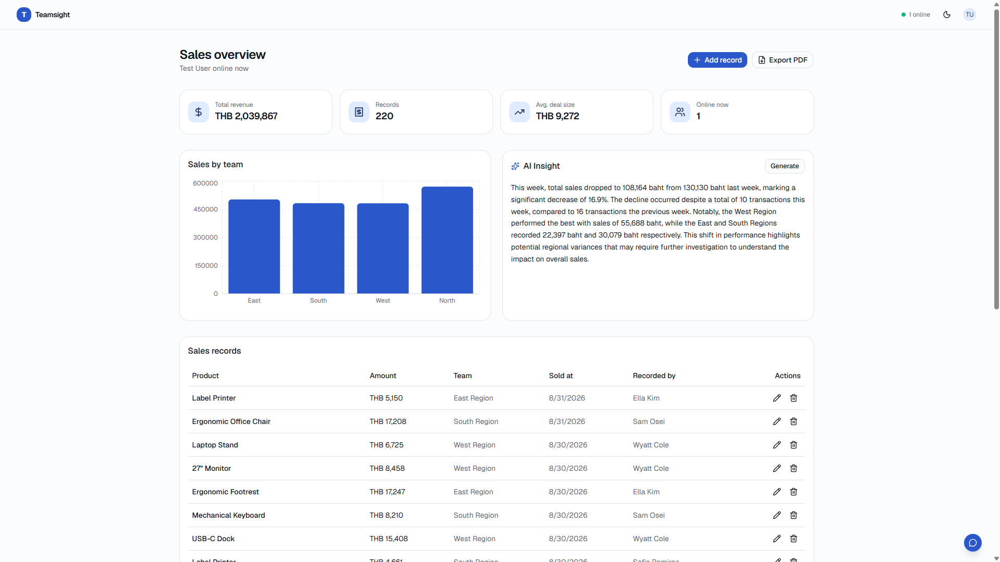

# Teamsight

Real-time sales dashboard for teams — everyone sees the same numbers, updated the moment they change, with an AI assistant that explains what's driving them.

**[Live demo](#)** · **[Backend repo](https://github.com/TWSNXDev/teamsight-server)**



## The problem

Sales teams usually work off a weekly report someone compiles by hand. Until that report goes out, nobody has a current picture — and when several people update the same spreadsheet, versions drift apart and nobody's sure which numbers are right. On top of that, reading a spreadsheet doesn't tell you *why* a number moved.

Teamsight is a small dashboard built to fix that: one shared view of sales data that updates live for everyone looking at it, with role-based permissions so people only see and edit what they should, and an AI layer that turns the raw numbers into a plain-language summary you can actually act on.

## What it does

- **Real-time sync** — add, edit, or delete a record and every connected browser updates instantly over WebSocket, no refresh
- **Role-based access** — Admins see and edit everything, Managers are scoped to their own team, Viewers are read-only, enforced on the server for every request, not just hidden in the UI
- **Conflict detection** — if two people edit the same record at once, the second save is rejected with a clear message instead of silently overwriting the first person's change
- **AI insight & chat** — generate a streamed, plain-language summary of recent sales, or ask follow-up questions grounded in the actual numbers (the model is told explicitly not to guess at anything it wasn't given)
- **Live presence** — see who else is currently looking at the dashboard
- **PDF export** — turn the current data and AI summary into a branded report in one click
- **Guest demo** — a "Try live demo" button signs a visitor in as a read-only viewer, no account needed

## Why two repos

Frontend and backend are split into separate services rather than using Next.js API routes for the backend. The real-time layer needs a long-running WebSocket server, which doesn't fit a serverless deploy model — so the backend runs as its own Express + Socket.io process, deployed independently from the Next.js frontend.

```
┌──────────────┐   REST + WebSocket    ┌───────────────────┐
│   Frontend    │ ───────────────────► │      Backend        │
│   Next.js     │ ◄─────────────────── │  Express + Socket.io │
│   (Vercel)    │                       │  (self-hosted VPS)   │
└──────────────┘                       └───────────────────┘
                                                  │
                                    ┌─────────────┼─────────────┐
                                    ▼                            ▼
                            ┌──────────────┐          ┌──────────────┐
                            │  PostgreSQL   │          │  OpenRouter   │
                            └──────────────┘          └──────────────┘
```

## Tech stack

| | |
|---|---|
| Framework | Next.js 16 (App Router), React 19, TypeScript |
| Styling | Tailwind CSS v4, shadcn/ui (Base UI) |
| Auth | Better Auth (email/password sessions) |
| Real-time | Socket.io client |
| Charts | Recharts |
| AI | OpenRouter (model swappable via a single env var) |
| PDF | jsPDF + jsPDF-AutoTable, with an embedded Thai font |

## A few implementation notes

**Conflict handling** uses optimistic concurrency rather than locking: every record carries an `updatedAt`, the client sends back the value it last saw when submitting an edit, and the server rejects the write if that no longer matches what's in the database. No locks, no polling — the person who loses the race just gets told to look again.

**The AI features** are deliberately boring about accuracy. The prompt is built from real, pre-aggregated numbers (this week's total, last week's total, percent change, per-team breakdown) computed server-side, and the model is instructed to only use those numbers and say so plainly if something can't be answered from them. Both the insight summary and the chat responses stream token-by-token rather than waiting for the full response.

**Role enforcement happens twice** — once in the UI (so people don't see actions they can't use) and independently on every API route (so the UI check is a convenience, not the actual security boundary).

## Running it locally

```bash
pnpm install
cp .env.example .env.local   # fill in NEXT_PUBLIC_API_URL
pnpm dev
```

Needs the [backend](https://github.com/TWSNXDev/teamsight-server) running alongside it — see that repo for setup.
